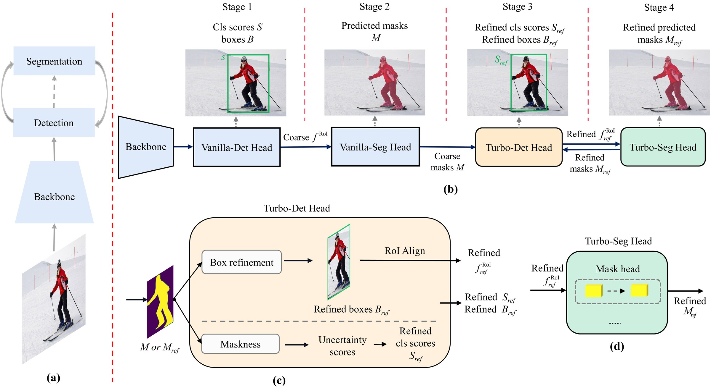
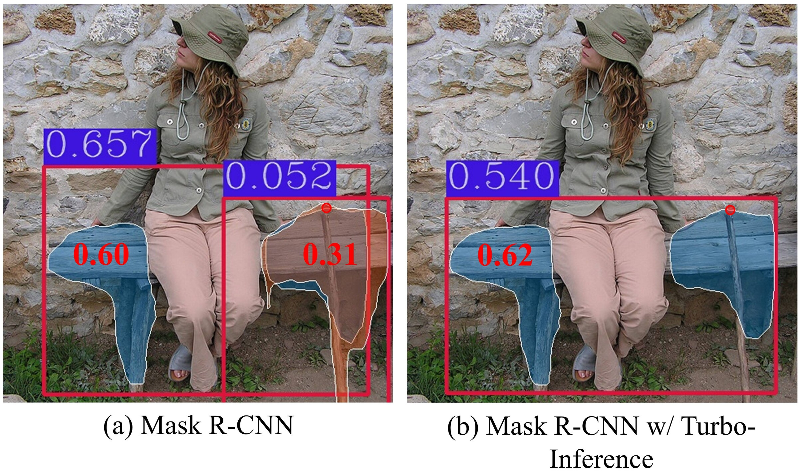
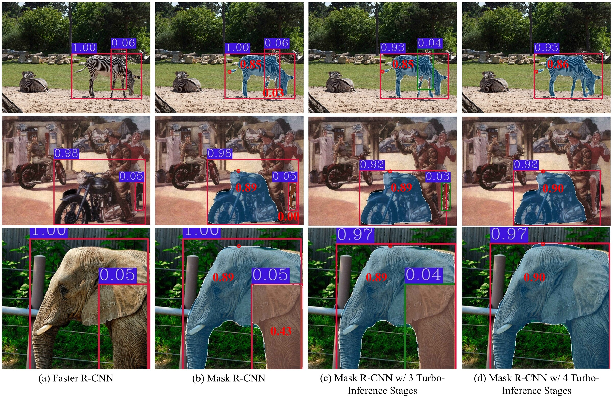
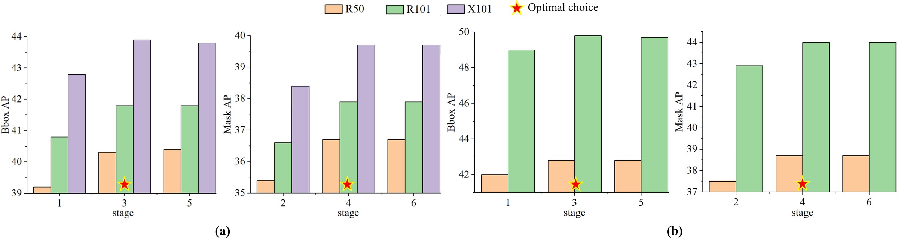

<div align="center">

# A Turbo-Inference Strategy for Object Detection and Instance Segmentation

### Training-free iterative refinement between detection and segmentation

[Zhen Zhao](https://github.com/zhaozhen2333) · Gang Zhang · Xiaolin Hu · Liang Tang

Beijing Forestry University · Tsinghua University · Chinese Institute for Brain Research

[](https://www.python.org/)
[](https://pytorch.org/)
[](https://github.com/open-mmlab/mmdetection)
[](https://arxiv.org/abs/2606.12371)
[](https://doi.org/10.1016/j.cviu.2026.104827)
[](#checkpoints)
[](LICENSE)

[Paper](https://doi.org/10.1016/j.cviu.2026.104827) · [arXiv](https://arxiv.org/abs/2606.12371) · [PDF](https://arxiv.org/pdf/2606.12371) · [Checkpoints](#checkpoints) · [Code](https://github.com/zhaozhen2333/Turbo-Learning)

> **Official implementation** of “A Turbo-Inference Strategy for Object Detection and Instance Segmentation,” published in *Computer Vision and Image Understanding* (CVIU), 2026.

**English** | [简体中文](README_zh-CN.md)

</div>

## Overview

Top-down instance segmentation normally follows a one-way **detect-then-segment** pipeline. Turbo-Inference closes the loop: coarse instance masks feed pixel-level localization and mask-quality information back to the detector, and the refined boxes are then used to predict better masks.

The method is **training-free**, reuses the pretrained mask head, and can be attached to existing top-down instance segmentation models without changing their training procedure.

<p align="center">
  
</p>

The feedback loop contains three operations:

1. **Box refinement** maps each RoI mask back to image coordinates and derives a tighter box from its foreground support.
2. **Maskness rescoring** estimates mask quality from the foreground probability distribution and fuses it with the classification score.
3. **Turbo segmentation** extracts RoI features from the refined boxes and reuses the original mask head to predict more accurate masks.

```text
Detection → coarse masks → refined boxes and scores → refined masks
                         ↖___________________________|
```

## Highlights

- **No retraining:** all refinement happens during inference.
- **Plug-and-play:** the shared `MaskBoxRefiner` module is configurable from the RoI head.
- **Joint improvement:** both bounding-box AP and mask AP benefit from segmentation feedback.
- **Broad applicability:** experimental paths are provided for Mask R-CNN, Cascade Mask R-CNN/HTC, QueryInst/Sparse R-CNN, and RTMDet-Ins.
- **Reproducible:** the released Mask R-CNN implementation has been freshly evaluated on all 5,000 COCO 2017 validation images.
- **Ready-to-use weights:** the [Checkpoint Zoo](#checkpoints) provides 21 pretrained models with original release links and matching configs.

## Qualitative Results

<p align="center">
  
</p>

Turbo-Inference produces tighter detection boxes, suppresses low-quality duplicate predictions, and improves instance masks.

<p align="center">
  
</p>

## Results

### Main results on COCO

Turbo-Inference consistently improves representative two-stage, cascade, query-based, and one-stage instance segmentation frameworks. The following compact table reports the main results from the paper; FPS was measured on one RTX 2080 Ti with batch size 2.

| Method | Backbone | bbox AP | bbox AP w/ Turbo | segm AP | segm AP w/ Turbo | FPS → Turbo FPS |
|:--|:--|--:|--:|--:|--:|--:|
| Mask R-CNN | R50-FPN | 39.2 | **40.3 (+1.1)** | 35.4 | **36.7 (+1.3)** | 15.7 → 12.0 |
| HTC | R50-FPN | 43.3 | **43.7 (+0.4)** | 38.3 | **39.2 (+0.9)** | 5.5 → 4.5 |
| RTMDet-m | CSPX-PAFPN | 48.8 | **49.3 (+0.5)** | 42.1 | **42.4 (+0.3)** | 3.7 → 2.7 |
| QueryInst | R50-FPN | 42.0 | **42.8 (+0.8)** | 37.5 | **38.7 (+1.2)** | 7.5 → 6.0 |

<details>
<summary><b>Results with additional backbones and model scales</b></summary>

| Method | Backbone | bbox AP | bbox AP w/ Turbo | segm AP | segm AP w/ Turbo | FPS → Turbo FPS |
|:--|:--|--:|--:|--:|--:|--:|
| Mask R-CNN | R101-FPN | 40.8 | **41.8** | 36.6 | **37.9** | 13.5 → 9.8 |
| Mask R-CNN | X101-FPN | 42.8 | **43.9** | 38.4 | **39.7** | 6.8 → 5.5 |
| Mask R-CNN | ConvNeXt-T-FPN | 46.2 | **47.5** | 41.7 | **42.8** | 14.5 → 10.8 |
| Mask R-CNN | Swin-T | 46.0 | **47.5** | 41.7 | **42.9** | 9.8 → 7.4 |
| Mask R-CNN | Swin-S | 48.2 | **49.4** | 43.2 | **44.5** | 9.3 → 6.3 |
| Mask R-CNN | ViT-B | 51.5 | **52.0** | 45.7 | **46.8** | 3.9 → 3.3 |
| Mask R-CNN | ConvNeXt-v2-FPN | 52.9 | **53.4** | 46.4 | **47.6** | 5.4 → 5.2 |
| HTC | R101-FPN | 44.8 | **45.1** | 39.6 | **40.5** | 5.2 → 4.3 |
| RTMDet-l | CSPX-PAFPN | 51.1 | **51.4** | 43.7 | **44.0** | 3.4 → 2.5 |
| RTMDet-x | CSPX-PAFPN | 52.4 | **52.7** | 44.6 | **44.9** | 2.8 → 2.2 |
| QueryInst | R101-FPN | 49.0 | **49.8** | 42.9 | **44.1** | 3.5 → 2.5 |

</details>

These results show that the feedback strategy is not tied to a particular detector, mask head, or backbone. As expected, the extra refinement stages trade inference speed for accuracy.

### Compatibility with training-free methods

All variants below were freshly evaluated with the same public Mask R-CNN R50-FPN 2x checkpoint on all 5,000 COCO 2017 validation images. Neither Turbo-Inference nor Soft-NMS requires retraining.

| Method | Turbo-Inference | Soft-NMS | bbox AP | bbox AP50 | bbox AP75 | segm AP | segm AP50 | segm AP75 |
|:--|:--:|:--:|--:|--:|--:|--:|--:|--:|
| Original Mask R-CNN |  |  | 39.993 | 59.556 | 43.577 | 35.175 | 56.346 | 37.719 |
| Mask R-CNN + Soft-NMS |  | ✓ | 40.618 | **59.600** | 44.620 | 35.423 | 56.371 | 38.126 |
| Mask R-CNN + Turbo | ✓ |  | 40.279 | 59.482 | 43.901 | 36.400 | **56.498** | 39.277 |
| Mask R-CNN + Turbo + Soft-NMS | ✓ | ✓ | **40.901** | 59.510 | **44.945** | **36.643** | 56.487 | **39.688** |

#### Complementary training-free refinement

Turbo-Inference and Soft-NMS improve different parts of the prediction pipeline. Soft-NMS adjusts scores from pairwise box overlaps, while Turbo-Inference uses instance-mask feedback to refine boxes, scores, and masks. Their gains are therefore complementary:

- Turbo-Inference alone improves bbox AP by **+0.286** and segm AP by **+1.225** over the original inference path.
- Adding Soft-NMS on top of Turbo-Inference contributes another **+0.622** bbox AP and **+0.243** segm AP.
- The combined training-free pipeline reaches **40.901 bbox AP** and **36.643 segm AP**, improving the original model by **+0.908** and **+1.468**, respectively.

This suggests that Turbo-Inference can be combined with other compatible training-free refinement or post-processing techniques for further gains, without updating the pretrained model weights.

The checkpoint used for verification has SHA-256:

```text
3e542a40ccc2952293c56bddc05e2002d681b9f6f20fde01f5908a5540b582b3
```

> Turbo-Inference trades additional head computation for accuracy. The backbone is not recomputed, but the refined RoIs pass through the mask head again.

## Installation

This repository is built on MMDetection 3.3.0. A typical installation is:

```bash
conda create -n turbo-inference python=3.8 -y
conda activate turbo-inference

pip install torch torchvision --index-url https://download.pytorch.org/whl/cu118
pip install -U openmim
mim install "mmengine>=0.7.1,<1.0.0"
mim install "mmcv>=2.0.0rc4,<2.2.0"
pip install -v -e .
```

See the [MMDetection installation guide](https://mmdetection.readthedocs.io/en/latest/get_started.html) if your CUDA or PyTorch version differs.

## Checkpoints

Pretrained weights are not stored in this repository because most files exceed GitHub's 100 MB per-file limit. Download them from their original release sources.

The default Mask R-CNN R50-FPN checkpoint used for the verified results is:

| Model | Config | Checkpoint | SHA-256 |
|:--|:--|:--|:--|
| Mask R-CNN R50-FPN 2x | [config](configs/mask_rcnn/mask-rcnn_r50_fpn_2x_coco.py) | [download](https://download.openmmlab.com/mmdetection/v2.0/mask_rcnn/mask_rcnn_r50_fpn_2x_coco/mask_rcnn_r50_fpn_2x_coco_bbox_mAP-0.392__segm_mAP-0.354_20200505_003907-3e542a40.pth) | `3e542a40…b582b3` |

```bash
mkdir -p checkpoints
wget -P checkpoints \
  https://download.openmmlab.com/mmdetection/v2.0/mask_rcnn/mask_rcnn_r50_fpn_2x_coco/mask_rcnn_r50_fpn_2x_coco_bbox_mAP-0.392__segm_mAP-0.354_20200505_003907-3e542a40.pth
```

<details>
<summary><b>Complete checkpoint zoo used in our experiments</b></summary>

| Model | Config / source | Official checkpoint |
|:--|:--|:--|
| Cascade Mask R-CNN ConvNeXt-S | [config](configs/convnext/cascade-mask-rcnn_convnext-s-p4-w7_fpn_4conv1fc-giou_amp-ms-crop-3x_coco.py) | [download](https://download.openmmlab.com/mmdetection/v2.0/convnext/cascade_mask_rcnn_convnext-s_p4_w7_fpn_giou_4conv1f_fp16_ms-crop_3x_coco/cascade_mask_rcnn_convnext-s_p4_w7_fpn_giou_4conv1f_fp16_ms-crop_3x_coco_20220510_201004-3d24f5a4.pth) |
| Cascade Mask R-CNN ConvNeXt-T | [config](configs/convnext/cascade-mask-rcnn_convnext-t-p4-w7_fpn_4conv1fc-giou_amp-ms-crop-3x_coco.py) | [download](https://download.openmmlab.com/mmdetection/v2.0/convnext/cascade_mask_rcnn_convnext-t_p4_w7_fpn_giou_4conv1f_fp16_ms-crop_3x_coco/cascade_mask_rcnn_convnext-t_p4_w7_fpn_giou_4conv1f_fp16_ms-crop_3x_coco_20220509_204200-8f07c40b.pth) |
| HTC R101-FPN 20e | [config](configs/htc/htc_r101_fpn_20e_coco.py) | [download](https://download.openmmlab.com/mmdetection/v2.0/htc/htc_r101_fpn_20e_coco/htc_r101_fpn_20e_coco_20200317-9b41b48f.pth) |
| HTC R50-FPN 1x | [config](configs/htc/htc_r50_fpn_1x_coco.py) | [download](https://download.openmmlab.com/mmdetection/v2.0/htc/htc_r50_fpn_1x_coco/htc_r50_fpn_1x_coco_20200317-7332cf16.pth) |
| Mask R-CNN ConvNeXt-v2-B | [config](projects/ConvNeXt-V2/configs/mask-rcnn_convnext-v2-b_fpn_lsj-3x-fcmae_coco.py) | [download](https://download.openmmlab.com/mmdetection/v3.0/convnextv2/mask-rcnn_convnext-v2-b_fpn_lsj-3x-fcmae_coco/mask-rcnn_convnext-v2-b_fpn_lsj-3x-fcmae_coco_20230113_110947-757ee2dd.pth) |
| Mask R-CNN ConvNeXt-T | [config](configs/convnext/mask-rcnn_convnext-t-p4-w7_fpn_amp-ms-crop-3x_coco.py) | [download](https://download.openmmlab.com/mmdetection/v2.0/convnext/mask_rcnn_convnext-t_p4_w7_fpn_fp16_ms-crop_3x_coco/mask_rcnn_convnext-t_p4_w7_fpn_fp16_ms-crop_3x_coco_20220426_154953-050731f4.pth) |
| Mask R-CNN R101-FPN 2x | [config](configs/mask_rcnn/mask-rcnn_r101_fpn_2x_coco.py) | [download](https://download.openmmlab.com/mmdetection/v2.0/mask_rcnn/mask_rcnn_r101_fpn_2x_coco/mask_rcnn_r101_fpn_2x_coco_bbox_mAP-0.408__segm_mAP-0.366_20200505_071027-14b391c7.pth) |
| Mask R-CNN R50-FPN 2x | [config](configs/mask_rcnn/mask-rcnn_r50_fpn_2x_coco.py) | [download](https://download.openmmlab.com/mmdetection/v2.0/mask_rcnn/mask_rcnn_r50_fpn_2x_coco/mask_rcnn_r50_fpn_2x_coco_bbox_mAP-0.392__segm_mAP-0.354_20200505_003907-3e542a40.pth) |
| Mask R-CNN Swin-S | [config](configs/swin/mask-rcnn_swin-s-p4-w7_fpn_amp-ms-crop-3x_coco.py) | [download](https://download.openmmlab.com/mmdetection/v2.0/swin/mask_rcnn_swin-s-p4-w7_fpn_fp16_ms-crop-3x_coco/mask_rcnn_swin-s-p4-w7_fpn_fp16_ms-crop-3x_coco_20210903_104808-b92c91f1.pth) |
| Mask R-CNN Swin-T | [config](configs/swin/mask-rcnn_swin-t-p4-w7_fpn_amp-ms-crop-3x_coco.py) | [download](https://download.openmmlab.com/mmdetection/v2.0/swin/mask_rcnn_swin-t-p4-w7_fpn_fp16_ms-crop-3x_coco/mask_rcnn_swin-t-p4-w7_fpn_fp16_ms-crop-3x_coco_20210908_165006-90a4008c.pth) |
| Mask R-CNN X101-64x4d-FPN | [config](configs/mask_rcnn/mask-rcnn_x101-64x4d_fpn_1x_coco.py) | [download](https://download.openmmlab.com/mmdetection/v2.0/mask_rcnn/mask_rcnn_x101_64x4d_fpn_1x_coco/mask_rcnn_x101_64x4d_fpn_1x_coco_20200201-9352eb0d.pth) |
| QueryInst R101-FPN, 300 proposals | [config](configs/queryinst/queryinst_r101_fpn_300-proposals_crop-ms-480-800-3x_coco.py) | [download](https://download.openmmlab.com/mmdetection/v2.0/queryinst/queryinst_r101_fpn_300_proposals_crop_mstrain_480-800_3x_coco/queryinst_r101_fpn_300_proposals_crop_mstrain_480-800_3x_coco_20210904_153621-76cce59f.pth) |
| QueryInst R101-FPN, 100 proposals | [config](configs/queryinst/queryinst_r101_fpn_ms-480-800-3x_coco.py) | [download](https://download.openmmlab.com/mmdetection/v2.0/queryinst/queryinst_r101_fpn_mstrain_480-800_3x_coco/queryinst_r101_fpn_mstrain_480-800_3x_coco_20210904_104048-91f9995b.pth) |
| QueryInst R50-FPN 1x | [config](configs/queryinst/queryinst_r50_fpn_1x_coco.py) | [download](https://download.openmmlab.com/mmdetection/v2.0/queryinst/queryinst_r50_fpn_1x_coco/queryinst_r50_fpn_1x_coco_20210907_084916-5a8f1998.pth) |
| QueryInst R50-FPN, 300 proposals | [config](configs/queryinst/queryinst_r50_fpn_300-proposals_crop-ms-480-800-3x_coco.py) | [download](https://download.openmmlab.com/mmdetection/v2.0/queryinst/queryinst_r50_fpn_300_proposals_crop_mstrain_480-800_3x_coco/queryinst_r50_fpn_300_proposals_crop_mstrain_480-800_3x_coco_20210904_101802-85cffbd8.pth) |
| QueryInst R50-FPN, 100 proposals | [config](configs/queryinst/queryinst_r50_fpn_ms-480-800-3x_coco.py) | [download](https://download.openmmlab.com/mmdetection/v2.0/queryinst/queryinst_r50_fpn_mstrain_480-800_3x_coco/queryinst_r50_fpn_mstrain_480-800_3x_coco_20210901_103643-7837af86.pth) |
| RTMDet-Tiny | [config](configs/rtmdet/rtmdet_tiny_8xb32-300e_coco.py) | [download](https://download.openmmlab.com/mmdetection/v3.0/rtmdet/rtmdet_tiny_8xb32-300e_coco/rtmdet_tiny_8xb32-300e_coco_20220902_112414-78e30dcc.pth) |
| ViTDet Mask R-CNN ViT-B | [config](projects/ViTDet/configs/vitdet_mask-rcnn_vit-b-mae_lsj-100e.py) | [download](https://download.openmmlab.com/mmdetection/v3.0/vitdet/vitdet_mask-rcnn_vit-b-mae_lsj-100e/vitdet_mask-rcnn_vit-b-mae_lsj-100e_20230328_153519-e15fe294.pth) |
| YOLOv12-M Seg | [source](https://github.com/sunsmarterjie/yolov12) | [download](https://github.com/sunsmarterjie/yolov12/releases/download/seg/yolov12m-seg.pt) |
| YOLOv12-L Seg | [source](https://github.com/sunsmarterjie/yolov12) | [download](https://github.com/sunsmarterjie/yolov12/releases/download/seg/yolov12l-seg.pt) |
| YOLOv12-X Seg | [source](https://github.com/sunsmarterjie/yolov12) | [download](https://github.com/sunsmarterjie/yolov12/releases/download/seg/yolov12x-seg.pt) |

</details>

## Quick Start

Download the default checkpoint above, then run:

```bash
python demo/image_demo.py \
  demo/demo.jpg \
  configs/mask_rcnn/mask-rcnn_r50_fpn_2x_coco.py \
  --weights checkpoints/mask_rcnn_r50_fpn_2x_coco_bbox_mAP-0.392__segm_mAP-0.354_20200505_003907-3e542a40.pth \
  --device cuda:0 \
  --out-dir outputs/turbo_mask_rcnn
```

Evaluate on COCO with one GPU:

```bash
python tools/test.py \
  configs/mask_rcnn/mask-rcnn_r50_fpn_2x_coco.py \
  /path/to/mask_rcnn_r50_fpn_2x_coco.pth
```

Or reproduce the eight-GPU regression:

```bash
./tools/dist_test.sh \
  configs/mask_rcnn/mask-rcnn_r50_fpn_2x_coco.py \
  /path/to/mask_rcnn_r50_fpn_2x_coco.pth 8 \
  --work-dir work_dirs/turbo_mask_rcnn_r50_8gpu
```

Prepare COCO in the standard MMDetection layout before evaluation:

```text
data/coco/
├── annotations/instances_val2017.json
└── val2017/
```

## Configuration

`MaskBoxRefiner` is registered in [`mmdet/models/utils/mask_box_refiner.py`](mmdet/models/utils/mask_box_refiner.py) and is enabled from the RoI head:

```python
roi_head=dict(
    type='StandardRoIHead',
    mask_box_refiner=dict(
        type='MaskBoxRefiner',
        box_threshold=0.20,
        score_threshold=0.35,
        mask_score_weight=0.35,
        empty_mask_fallback=False))
```

| Option | Meaning |
|:--|:--|
| `box_threshold` | Foreground threshold used to derive a tight box from a mask. |
| `score_threshold` | Foreground threshold used when computing maskness. |
| `mask_score_weight` | Weight of the mask-aware score in score fusion. |
| `empty_mask_fallback` | Whether an empty foreground mask falls back to the input box. |

Set `mask_box_refiner=None` to recover the upstream MMDetection inference path. The provided Mask R-CNN R50-FPN configuration also uses Soft-NMS with an IoU threshold of 0.5.

## Stage-wise Refinement

<p align="center">
  
</p>

For Mask R-CNN and HTC, four stages are used by default: detection, vanilla segmentation, turbo detection, and turbo segmentation. QueryInst uses three stages because another mask-head pass can disturb the interaction between its proposal features and refined RoI features.

## Implementation Status

Turbo-Inference is fully implemented for every model family listed below. These paths can be used directly with existing pretrained weights and require no retraining.

| Model family | Turbo-Inference |
|:--|:--:|
| Mask R-CNN | ✓ |
| Cascade Mask R-CNN / HTC | ✓ |
| QueryInst / Sparse R-CNN | ✓ |
| RTMDet-Ins | ✓ |

### Roadmap

- [x] Training-free Turbo-Inference for Mask R-CNN.
- [x] Training-free Turbo-Inference for Cascade Mask R-CNN / HTC.
- [x] Training-free Turbo-Inference for QueryInst / Sparse R-CNN.
- [x] Training-free Turbo-Inference for RTMDet-Ins.
- [x] Compatibility with Soft-NMS and other training-free refinements.
- [ ] Introduce the Turbo feedback loop during training and learn stronger Turbo-aware weights.

The current release focuses on training-free inference with existing checkpoints. The fresh Mask R-CNN Turbo-only and Turbo + Soft-NMS evaluation logs are stored in `work_dirs/turbo_mask_rcnn_r50_no_softnms_8gpu/` and `work_dirs/turbo_mask_rcnn_r50_readme_rerun_8gpu/`, respectively. The remaining research direction is joint training with Turbo feedback to obtain better model weights. CondInst is intentionally excluded from this release.

## Citation

If this project is useful in your research, please cite:

```bibtex
@article{zhao2026turboinference,
  title   = {A turbo-inference strategy for object detection and instance segmentation},
  author  = {Zhao, Zhen and Zhang, Gang and Hu, Xiaolin and Tang, Liang},
  journal = {Computer Vision and Image Understanding},
  volume  = {270},
  pages   = {104827},
  year    = {2026},
  doi     = {10.1016/j.cviu.2026.104827}
}
```

Preprint: [arXiv:2606.12371](https://arxiv.org/abs/2606.12371).

## Acknowledgements

This implementation is based on [MMDetection](https://github.com/open-mmlab/mmdetection). We thank the OpenMMLab contributors and the authors of the supported instance segmentation methods.

## License

This codebase is released under the [Apache 2.0 license](LICENSE). Please also follow the licenses of MMDetection, its dependencies, datasets, and pretrained models.
